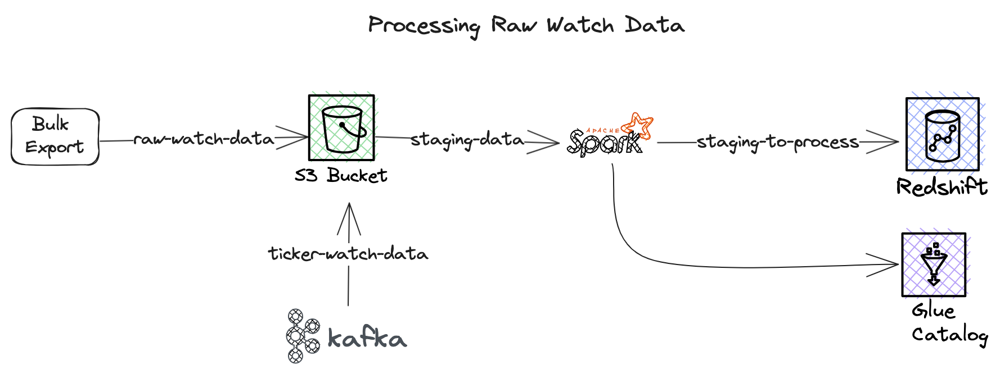
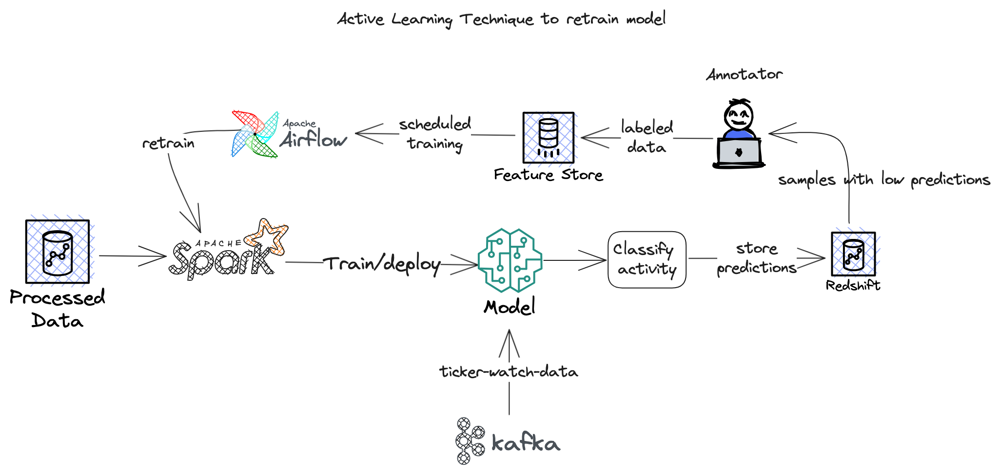
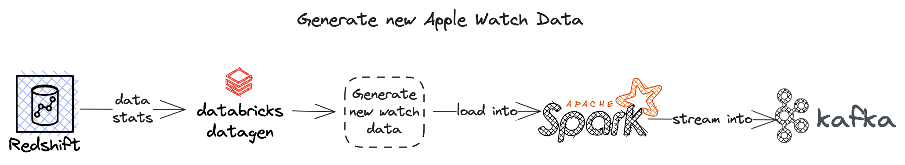

# Smartwatch AWS Lakehouse
Lakehouse for staging, modeling, classifying, and generating new Apple SmartWatch Data. We will use AWS S3, AWS EMR, 
Kafka, Apache Spark, and Databricks Datagen.

## Data Loading
The first stage of the application is to load bulk data from Washington State University (WSU)
Center of Advanced Studies in Adaptive Systems (CASAS) archives 
 [https://casas.wsu.edu/datasets/smartwatch/](https://casas.wsu.edu/datasets/smartwatch/) into
a staging folder in an S3 bucket. We use a Spark job on EMR to clean the data (remove null values)
and load them into a glue table.

## Model Training
The cleaned up data is used to train a Classifier to predict the recorded activity using the watch raw
data. The notebook to perform this can be found here [Activity Classifier](lakehouse/spark/notebooks/Train%20Activity%20Classifier.ipynb)

The trained model will be used to predict the activity of new samples streamed from a kafka topic using spark streaming
later in the application. 

### Active Learning
To retrain the model with new samples, active learning technique is used. When new data samples are streamed from kafka 
topic, the activities on those samples are predicted using the model trained above. Misclassified samples are labeled with 
the correct class labels by a human annotator and saved to a feature store. Airflow routinely picks samples in the feature
store and retrains the model. If the new model has a better than the old one, it is used to classify new streaming samples

## Kafka Streaming
To simulate the generation of new Apple Watch Data, we will use [Databricks Labs DataGen](https://github.com/databrickslabs/dbldatagen)
and the descriptive statistics calculated from the raw data samples. This ensures that generated data maintains the 
distribution of the original dataset. 
The generated data is loaded into spark streaming and written into a kafka topic. The activity prediction pipeline above
picks up the data in the topics and makes predictions. The samples with low predictions are sent to the annotation pipeline 
that will be used to retrain the model at a later date. 

